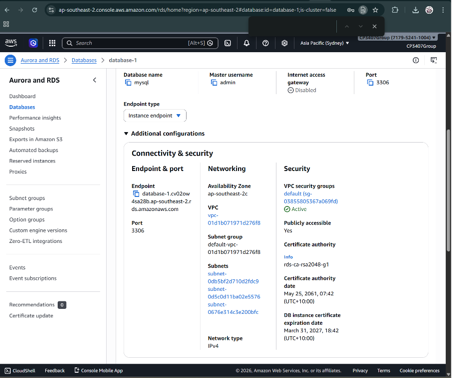
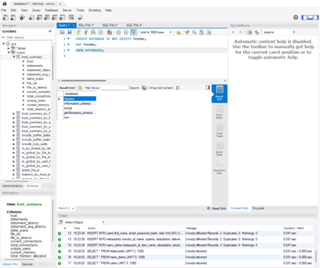
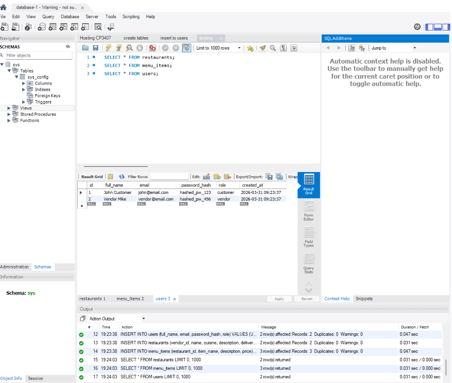

Cloud Database Deployment (Amazon RDS)
A production-ready MySQL relational database was successfully deployed on Amazon RDS.
The hosted schema currently includes:
•	users
•	restaurants
•	menu_items
•	orders
•	reviews
•	order_history
Sample production data was inserted successfully to validate the cloud deployment.
This deployed database supports:
•	authentication
•	restaurant browsing
•	menu management
•	order placement
•	future vendor analytics
•	review system
•	admin approval workflow
This deployment choice improves scalability, maintainability, and production readiness.

